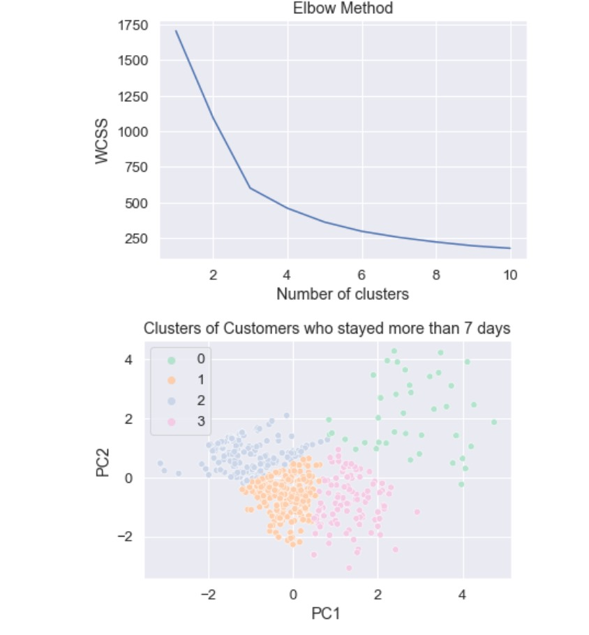

# Hotel reservation analysis
This project involves analyzing a hotel reservation dataset to uncover insights and trends related to customer bookings. The analysis includes data cleaning, exploratory data analysis (EDA), and visualization of key metrics. The project is implemented in a Jupyter Notebook.

Key Features
Data Loading and Cleaning:
Importing the dataset and handling missing values.
Converting data types where necessary.
Removing duplicates and irrelevant columns.
Exploratory Data Analysis (EDA):

Summary statistics for numerical and categorical features.
Distribution of booking patterns over time.
Analysis of cancellation rates, booking lead times, and customer demographics.
Correlation analysis between different features.

Visualization:
Time series plots to visualize booking trends.
Bar charts, pie charts, and histograms to show the distribution of various features.
Heatmaps to analyze correlations.

* Customer Types: Majority of bookings made by adults, indicating preference among adult travelers or couples.

* Cancellation Rates: Families with children exhibit slightly higher cancellation rate, possibly due to more variables involved.

* Weekend vs. Weeknights: Customers prefer staying during weeknights, suggesting popularity among business travelers.

* Extended Stays: Less common, indicating focus on short-term visitors.

* Meal Plan Preferences: "Meal Plan 1" overwhelmingly popular among non-cancelled bookings.

* Room Type Choices: "Room_Type 1" dominates bookings, likely meeting needs of most guests.

* Booking Distribution: Bookings peak in October, with seasonal variations influenced by local events and weather conditions.

* Customer Similarities: Common preferences point to well-defined target market or guest profile.

* Outliers in Data: Significant outliers in lead times indicate segment of guests planning far in advance.
  

